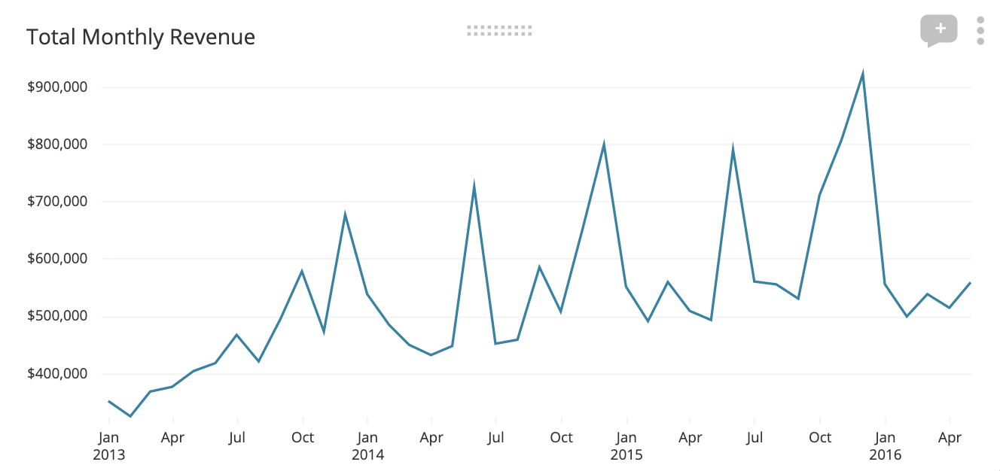

# Text-Em-All SQL Challenge

## Requirements

You will need the following to complete this coding challenge:

1. SQL Server 2016 or later
2. A SQL client of your choice (e.g. SSMS on Windows or Azure Data Studio on Mac)

## Setup

1. Download [WideWorldImporters-Full.bak](https://github.com/Microsoft/sql-server-samples/releases/download/wide-world-importers-v1.0/WideWorldImporters-Full.bak) and use to create the WideWorldImporters database on your SQL Server instance.
2. Please see this [documentation](https://docs.microsoft.com/en-us/sql/samples/wide-world-importers-what-is?view=sql-server-ver15) for a quick overview of the fictitious company this data is meant to represent.

## Challenge 1

The leadership team has asked us to graph total monthly sales over time. **Write a query that returns the data we need to complete this request.**

*The numbers from this chart may not match those from the WideWorldImporters database sample, this is just an example.*

## Challenge 2

What is the fastest growing customer category in Q1 2016 (compared to same quarter sales in the previous year)? What is the growth rate?

## Challenge 3

Write a query to return the list of suppliers that World Wide Importers has purchased from, along with # of invoices paid, # of invoices still outstanding, and average invoice amount.

## Challenge 4
Considering sales volume, which item in the warehouse has the lowest gross profit amount? Which item has the highest? What is the **median** gross profit across all items in the warehouse?

## Submission

1. Make your answers available to us, ideally in a public Git repository. You
   may also try to email them, but there is a
   chance this will be blocked by email filters. In that case, be prepared to use another
   method, such as Dropbox or Google Drive.
2. Please include estimated time used to complete the challenge.
3. Please include all of your SQL queries.
